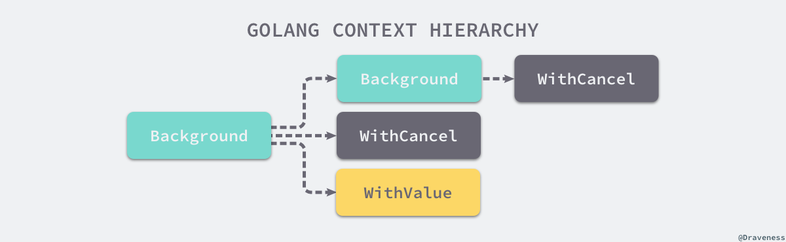

# goroutines && channels

## go routine基础
GO并发推荐使用“顺序通信进程”（communicating sequential processes， CSP），CSP是一种现代的并发编程模型，在这种模型中值会在不同的运行实例（goroutine）中传递。

GO语言中每一个并发的执行单元叫作一个goroutine。当一个程序启动时，其主函数即在一个单独的goroutine中运行，我们叫它**main goroutine**。新的goroutine会用go语句来创建。在语法上，go语句是一个普通的函数或方法调用前加上关键字go。go语句会使其语句中的函数在一个新创建的goroutine中运行。而go语句本身会迅速地完成。

```go
f()    // call f(); wait for it to return
go f() // create a new goroutine that calls f(); don't wait
```

主函数返回时，所有的goroutine都会被直接打断，程序退出。除了 **从主函数退出或者直接终止程序**之外，没有其它的编程方法能够让一个goroutine来打断另一个的执行。

## channel基础

channel是go routine之间的通信机制，一个channel可以让一个goroutine通过它给另一个goroutine发送值信息。每个channel都有一个特殊的类型，也就是channels可发送数据的类型。一个可以发送int类型数据的channel一般写为`chan int`。channel一般使用内置的make函数创建。

```go
ch := make(chan int)
```

和map类似，channel也对应一个make创建的底层数据结构的引用。当我们复制一个channel或用于函数参数传递时，我们只是拷贝了一个channel引用，因此调用者和被调用者将引用同一个channel对象。和其它的引用类型一样，channel的零值也是nil。 两个相同类型的channel可以使用==运算符比较。如果两个channel引用的是相同的对象，那么比较的结果为真。一个channel也可以和nil进行比较。

channel有发送和接受两个主要操作，发送是将一个值从一个goroutine发送到接收的goroutine，发送和接收两个操作都使用`<-`运算符。在发送语句中，`<-`运算符分割channel和要发送的值。在接收语句中，`<-`运算符写在channel对象之前。一个不使用接收结果的接收操作也是合法的。
Channel还支持close操作，用于关闭channel，随后对基于该channel的任何发送操作都将导致panic异常。对一个已经被close过的channel进行接收操作依然可以接受到之前已经成功发送的数据；如果channel中已经没有数据的话将产生一个零值的数据。

```go
ch <- x  // a send statement
x = <-ch // a receive expression in an assignment statement
<-ch     // a receive statement; result is discarded
close(ch)
```

### 无缓存 vs. 有缓存

channel分为有缓存和无缓存的版本，使用`make`创建的时候可以指定第二个整形参数，对应channel的容量。
```go
ch = make(chan int)    // unbuffered channel
ch = make(chan int, 0) // unbuffered channel
ch = make(chan int, 3) // buffered channel with capacity 3
```

一个基于无缓存Channels的发送操作将导致发送者goroutine阻塞，直到另一个goroutine在相同的Channels上执行接收操作，当发送的值通过Channels成功传输之后，两个goroutine可以继续执行后面的语句。反之，如果接收操作先发生，那么接收者goroutine也将阻塞，直到有另一个goroutine在相同的Channels上执行发送操作。也就说：基于无缓存Channels的发送和接收操作将导致两个goroutine做一次同步操作。

> 无缓存channels有时也被称为同步channels，当通过一个无缓存Channels发送数据时，接收者收到数据发生在再次唤醒发送者goroutine之前（happen before原则）


## 基于select的多路复用


## 上下文Context

### Context基础

上下文`context.Context`是Go语言中用来设置截止日期、同步信号，传递请求相关值的结构体。上下文与`Goroutine`有比较密切的关系，是`Go`语言中独特的设计。`context.Context`是Go语言在1.7版本中引入标准库的接口1，该接口定义了四个需要实现的方法，其中包括：

1. `Deadline` — 返回 context.Context 被取消的时间，也就是完成工作的截止日期；
2. `Done` — 返回一个 Channel，这个 Channel 会在当前工作完成或者上下文被取消后关闭，多次调用 Done 方法会返回同一个 Channel；
3. `Err` — 返回 context.Context 结束的原因，它只会在 Done 方法对应的 Channel 关闭时返回非空的值； 如果 context.Context 被取消，会返回 Canceled 错误； 如果 context.Context 超时，会返回 DeadlineExceeded 错误；
4. `Value` — 从 context.Context 中获取键对应的值，对于同一个上下文来说，多次调用 Value 并传入相同的 Key 会返回相同的结果，该方法可以用来传递请求特定的数据；

```go
type Context interface {
	Deadline() (deadline time.Time, ok bool)
	Done() <-chan struct{}
	Err() error
	Value(key interface{}) interface{}
}
```


context 包中提供的`context.Background`,`context.TODO`、`context.WithDeadline`和`context.WithValue`函数会返回实现该接口的私有结构体。

在 Goroutine 构成的树形结构中对信号进行同步以减少计算资源的浪费是`context.Context`的最大作用,Go服务的每一个请求都是通过单独的 Goroutine 处理的2，HTTP/RPC 请求的处理器会启动新的 Goroutine 访问数据库和其他服务。

每一个`context.Context`都会从最顶层的 Goroutine 一层一层传递到最下层。`context.Context`可以在上层 Goroutine 执行出现错误时，将信号及时同步给下层。当最上层的 Goroutine 因为某些原因执行失败时，下层的 Goroutine 由于没有接收到这个信号所以会继续工作；但是当我们正确地使用`context.Context`时，就可以在下层及时停掉无用的工作以减少额外资源的消耗。


context 包中最常用的方法还是`context.Background`,`context.TODO`，这两个方法都会返回预先初始化好的私有变量 background 和 todo，它们会在同一个 Go 程序中被复用。这两个私有变量都是通过 `new(emptyCtx)` 语句初始化的，它们是指向私有结构体 `context.emptyCtx` 的指针，这是最简单、最常用的上下文类型。不难发现`context.emptyCtx`通过空方法实现了`context.Context`接口中的所有方法，它没有任何功能。

```go
func Background() Context {
	return background
}

func TODO() Context {
	return todo
}

type emptyCtx int

func (*emptyCtx) Deadline() (deadline time.Time, ok bool) {
    return
}

func (*emptyCtx) Done() <-chan struct{} {
    return nil
}

func (*emptyCtx) Err() error {
    return nil
}

func (*emptyCtx) Value(key interface{}) interface{} {
    return nil
}
```



`context.Background`和`context.TODO`也只是互为别名，没有太大的差别，只是在使用和语义上稍有不同：`context.Background`是上下文的默认值，所有其他的上下文都应该从它衍生出来； `context.TODO`应该仅在不确定应该使用哪种上下文时使用； 在多数情况下，如果当前函数没有上下文作为入参，我们都会使用 `context.Background` 作为起始的上下文向下传递。

### 取消信号

### 传值方法


# 基于共享变量的并发

大部分的类型都不是并发安全（并发安全的类型是例外，而不是规则），所以应该尽量避免并发访问大多数的类型，无论是将变量局限在单一的一个goroutine内，还是用互斥条件维持更高级别的不变性，都是为了这个目的。一个函数在并发调用时没法工作的原因太多了，比如死锁（deadlock）、活锁（livelock）和饿死（resource starvation），通常我们最关注的是竞争条件。竞争条件指的是程序在多个goroutine交叉执行操作时，没有给出正确的结果。

> 无论任何时候，只要有两个goroutine并发访问同一变量，且至少其中的一个是写操作的时候就会发生数据竞争

```go
var x []int
go func() { x = make([]int, 10) }()
go func() { x = make([]int, 1000000) }()
x[999999] = 1 // NOTE: undefined behavior; memory corruption possible!
```

解决数据竞争的一般方法：

1. 避免写操作，类似`final`变量
2. 避免从多个goroutine访问变量，比如仅允许一个go routine去操作变量，其他go routine使用channel来查询更新变量（即通信代替共享）。一个提供对一个指定的变量通过channel来请求的goroutine叫做这个变量的monitor（监控）goroutine
3. 允许多go routine, 但是同一时刻只有一个可以访问（互斥）
