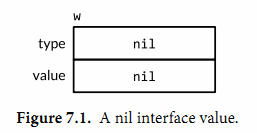

# 基础拾遗

## 类型

1. 整型: int8/int16/int32/int64, uint8/uint16/uint32/uint64; int和uint类型是对应特定CPU平台机器字大小，长度不定。`rune`是和`int32`等价的类型，通常用于表示一个Unicode码点，`byte`是`uint8`的等价类型。

> 很多时候即使数值本身不可能出现负数，也倾向于使用有符号的int类型，就像数组的长度一样。否则当我们逆序遍历时`for i := len(arr); i >= 0; i--`条件会永远为true。所以一般无符号整数一般用于位操作、哈希和加密操作等

2. 浮点型：建议使用float64, 而不是float32, 因为float32的表示范围和精度相对较差

## 打印

`fmt.Printf`格式化打印：

1. `%T`: 用于显示一个值对应的数据类型
2. `%t`: 是用于打印布尔型数据
3. `%x`: 以十六进制的格式打印数组或slice全部的元素，`%#x`会增加`0x`前缀
4. `%o`: 以八进制的格式打印, `%#o`会增加`0`前缀
5. `%g`: 以紧凑的形式打印浮点数
6. `%e`,`%f`: 以指数形式、小数形式打印浮点数，`%8.3f`表示打印宽度为8，精确为3
7. `%v`: 以默认格式输出变量，`%+v`: 对结构体加字段名的方式输出，`%#v`: 以 Go 语法格式化输出

## 声明

1. Go语言主要有四种类型的声明语句：`var`、`const`、`type`和`func`，分别对应变量、常量、类型和函数实体对象的声明。
2. `var`用来变量声明，变量会在声明时直接初始化，如果变量没有显式初始化，则被隐式地赋予其类型的 零值（zero value），数值类型是 0，字符串类型是空字符串 `""`, 布尔类型是false，接口或者引用类型(包含slice、指针、map、chan等)对应的是`nil`。
3. 符号`:=`是 短变量声明 的一部分，是定义一个或多个变量并根据它们的初始值为这些变量赋予适当类型的语句，短变量声明只能用在函数的内部，不能用于包变量
4. 一般使用`type 类型名字 底层类型`进行类型声明，这样会创建一个新的类型名称，和现有类型具有相同的底层结构，新类型可以用来分隔不同概念的类型，这样即使底层类型相同也是不兼容的


## 可见性

1. 在函数内部定义的变量仅在函数内部有效，在函数外部定义的变量在当前包的所有文件中的都可以访问
2. 名字的开头字母大小写决定了名字在包外的可见性，大写字母开头的将是导出的，也就是可以被外部的包访问，例如`fmt`包的`Println`，包本身的名字一般总是用小写字母
3. 推荐使用 **驼峰式** 的命名方式


## new函数
表达式 `new(T)`会创建一个T类型的匿名变量，初始化为T类型的零值，然后返回变量地址（`*T`类型）

## 函数习惯

在GO语言中，经常会出现返回多个值的函数，通常这类函数会用额外的返回值来表达某种错误类型，一般来说返回一个error类型的错误，或者返回一个布尔值通常称为ok

```go
f, err = os.Open("foo.txt")
v, ok = m[key] // map lookup
v, ok = x.(T)  // type assertion
_, ok = m[key] 
```

## 包

一个包的源代码保存在一个或多个以.go为文件后缀名的源文件中，通常一个包所在目录路径的后缀是包的导入路径。每个包都对应一个独立的名字空间。例如，在`image`包中的`Decode`函数和在`unicode/utf16`包中的`Decode`函数是不同的。要在外部引用该函数，必须显式使用`image.Decode`或`utf16.Decode`形式访问。

在每个源文件的包声明前紧跟着的注释是包注释（§10.7.4）。通常，包注释的第一句应该先是包的功能概要说明。一个包通常只有一个源文件有包注释（译注：如果有多个包注释，目前的文档工具会根据源文件名的先后顺序将它们链接为一个包注释）。如果包注释很大，通常会放到一个独立的doc.go文件中。

包的初始化：包的初始化首先是解决包级变量的依赖顺序，然后按照包级变量声明出现的顺序依次初始化。其次如果包中含有多个.go源文件，它们将按照发给编译器的顺序进行初始化，Go语言的构建工具首先会将.go文件根据文件名排序，然后依次调用编译器编译。

特殊的init函数：有些包级别的变量需要比较复杂的初始化，此时可以使用特殊的`init`函数进行初始化，

## 字符串

一个字符串是一个不可改变的字节序列。字符串可以包含任意的数据，包括byte值0，但是通常是用来包含人类可读的文本。文本字符串通常被解释为采用UTF8编码的Unicode码点（rune）序列。

字符串是不可变的，所以尝试修改字符串内部结构的操作是被禁止的，执行`s[0]=L`会提示编译报错。不变性意味着如果两个字符串共享相同的底层数据的话也是安全的，这使得复制任何长度的字符串代价是低廉的。

一个原生的字符串面值形式是`` `...` ``，使用反引号代替双引号。在原生的字符串面值中，没有转义操作；全部的内容都是字面的意思，包含退格和换行，因此一个程序中的原生字符串面值可能跨越多行（译注：在原生字符串面值内部是无法直接写`` ` ``字符的，可以用八进制或十六进制转义或`` +"`" ``连接字符串常量完成）。唯一的特殊处理是会删除回车以保证在所有平台上的值都是一样的，包括那些把回车也放入文本文件的系统（译注：Windows系统会把回车和换行一起放入文本文件中）。

```go
const GoUsage = `Go is a tool for managing Go source code.

Usage:
    go command [arguments]
...`
```

### Unicode编码

目前Unicode标准里收集了超过120,000个字符，涵盖超过100多种语言。这些在计算机程序和数据中是如何体现的呢？通用的表示一个Unicode码点的数据类型是int32，也就是Go语言中rune对应的类型；它的同义词`rune`符文正是这个意思。我们可以将一个符文序列表示为一个int32序列。这种编码方式叫UTF-32或UCS-4，每个Unicode码点都使用同样大小的32bit来表示。这种方式比较简单统一，但是它会浪费很多存储空间。UTF8是一个将Unicode码点编码为字节序列的变长编码, 可以很好的节省空间，兼容ASCII编码，但是无法直接通过索引访问第n个字符。

Go语言的源文件采用UTF8编码，并且Go语言处理UTF8编码的文本也很出色。unicode包提供了诸多处理rune字符相关功能的函数（比如区分字母和数字，或者是字母的大写和小写转换等），unicode/utf8包则提供了用于rune字符序列的UTF8编码和解码的功能。例如，下面的字符串面值都表示相同的值

```
"世界"
"\xe4\xb8\x96\xe7\x95\x8c"
"\u4e16\u754c"
"\U00004e16\U0000754c"
```

`len`函数得到的是字符串占用的字节长度，如果需要关注实际的字符数量可以使用`utf8.RuneCountInString`。我们也可以借助 `unicode/utf8` 进行对应字符的遍历，当然最简单的方式是直接借助`range`循环，底层会自动隐式解码UTF8字符串。

```go
import "unicode/utf8"

s := "Hello, 世界"
fmt.Println(len(s))                    // "13"
fmt.Println(utf8.RuneCountInString(s)) // "9"
// 借助unicode/utf8包进行遍历
for i := 0; i < len(s); {
    // DecodeRuneInString函数都返回一个r和长度，r对应字符本身，长度对应r采用UTF8编码后的编码字节数目
    r, size := utf8.DecodeRuneInString(s[i:])
    fmt.Printf("%d\t%c\n", i, r)
    i += size
}
for i, r := range s {
    fmt.Printf("%d\t%q\t%d\n", i, r, r)
}
```

UTF8字符串作为交换格式的时候十分方便，但是在程序中很多时候转换为rune序列更加方便，因为rune大小一致，支持数组索引和方便切割。

```go
s := "プログラム"
//% x中用于在每个十六进制数字前插入空格
fmt.Printf("% x\n", s) // "e3 83 97 e3 83 ad e3 82 b0 e3 83 a9 e3 83 a0"
// []rune和string直接相互转换
r := []rune(s)
fmt.Printf("%x\n", r)  // "[30d7 30ed 30b0 30e9 30e0]"
s2 = string(r)
```

### 字符串处理

标准库中有四个包对字符串处理尤为重要：bytes、strings、strconv和unicode包。

strings包提供了许多如字符串的查询、替换、比较、截断、拆分和合并等功能。

bytes包也提供了很多类似功能的函数，但是针对和字符串有着相同结构的[]byte类型。因为字符串是只读的，因此逐步构建字符串会导致很多分配和复制。在这种情况下，使用bytes.Buffer类型将会更有效。

strconv包提供了布尔型、整型数、浮点数和对应字符串的相互转换，还提供了双引号转义相关的转换。

unicode包提供了IsDigit、IsLetter、IsUpper和IsLower等类似功能，它们用于给字符分类。每个函数有一个单一的rune类型的参数，然后返回一个布尔值。而像ToUpper和ToLower之类的转换函数将用于rune字符的大小写转换。所有的这些函数都是遵循Unicode标准定义的字母、数字等分类规范。strings包也有类似的函数，它们是ToUpper和ToLower，将原始字符串的每个字符都做相应的转换，然后返回新的字符串。

字符串是只读的，一旦创建不可改变，但是字节slice或者rune slice则可以自由的修改。字符串和字节slice之间的转换：

```go
s := "abc"
b := []byte(s)
s2 := string(b)
```

从概念上讲，一个[]byte(s)转换是 **分配了一个新的字节数组用于保存字符串数据的拷贝**，然后引用这个底层的字节数组。编译器的优化可以避免在一些场景下分配和复制字符串数据，但总的来说需要确保在变量b被修改的情况下，原始的s字符串也不会改变。将一个字节slice转换到字符串的string(b)操作则是构造一个字符串拷贝，以确保s2字符串是只读的。

为了避免转换中不必要的内存分配，`bytes`包和`strings`包提供了很多使用的函数。

```go
// strings包中
func Contains(s, substr string) bool
func Count(s, sep string) int
func Fields(s string) []string
func HasPrefix(s, prefix string) bool
func Index(s, sep string) int
func Join(a []string, sep string) string
// bytes包中的
func Contains(b, subslice []byte) bool
func Count(s, sep []byte) int
func Fields(s []byte) [][]byte
func HasPrefix(s, prefix []byte) bool
func Index(s, sep []byte) int
func Join(s [][]byte, sep []byte) []byte
```

`bytes`包还提供了Buffer类型用于字节slice的缓存。一个Buffer开始是空的，但是随着string、byte或[]byte等类型数据的写入可以动态增长，一个bytes.Buffer变量并不需要初始化，因为零值也是有效的。

### 字符串和数字的转换

字符串和数字之间的转换一般由 `strconv`包提供。

将一个整数转为字符串，一种方法是用`fmt.Sprintf`返回一个格式化的字符串；另一个方法是用 `strconv.Itoa()`。`strconv`包的`FormatInt`和`FormatUint`函数可以用不同的进制来格式化数字

```go
x := 123
fmt.Sprintf("%d", x)
strconv.Itoa(x)

fmt.Println(strconv.FormatInt(int64(x), 2)) // "1111011"
// 当然用%b,%o,%x更方便
s := fmt.Sprintf("x=%b", x) // "x=1111011"
```

如果要将一个字符串解析为整数，可以使用`strconv`包的`Atoi`或`ParseInt`函数，还有用于解析无符号整数的`ParseUint`函数。ParseInt函数的第三个参数是用于指定整型数的大小；例如16表示int16，0则表示int。在任何情况下，返回的结果y总是int64类型，你可以通过强制类型转换将它转为更小的整数类型。

```go
x, err := strconv.Atoi("123")             // x is an int
y, err := strconv.ParseInt("123", 10, 64) // base 10, up to 64 bits
```

### 字符串拼接

在go中有很多种方式进行字符串拼接：
1. 使用连接运算符：s = "Hello," + s
2. 使用`fmt.Sprintf`进行格式化拼接：`fmt.Sprintf("[name]: %s; [age]: %d", s1, s2)`
3. 使用`bytes.Buffer`，可以使用`Grow`方法来预分配内存空间的大小，减少后期的缓冲区扩容操作，`Reset`方法可以清空缓存区
4. 使用`strings.Builder`，同样有`Grow`方法

从性能角度，建议选择4。

## 常量

常量都是在编译期计算，而不是运行期。

常量声明可以使用iota常量生成器初始化，它用于生成一组以相似规则初始化的常量，但是不用每行都写一遍初始化表达式。在一个const声明语句中，在第一个声明的常量所在的行，iota将会被置为0，然后在每一个有常量声明的行加一。

```go
type Weekday int

const (
    Sunday Weekday = iota
    Monday
    Tuesday
    Wednesday
    Thursday
    Friday
    Saturday
)

type Flags uint

// 也可以在常量表达式中使用iota
const (
    FlagUp Flags = 1 << iota // is up
    FlagBroadcast            // supports broadcast access capability
    FlagLoopback             // is a loopback interface
    FlagPointToPoint         // belongs to a point-to-point link
    FlagMulticast            // supports multicast access capability
)
```

# 复合数据类型

常用的复合类型有数组、slice、map和结构体。

## 数组

数组是由固定长度的特定类型元素组成的序列，默认情况下数组的每个元素都被初始化为元素类型对应的零值。

数组的长度是数组类型的一个组成部分，因此[3]int和[4]int是两种不同的数组类型。数组的长度必须是常量表达式，因为数组的长度需要在编译阶段确定。

数组初始化方式:

```go
// 数组初始化
var b [3]float32 = [3]float32{1.1, 2.4, 5.6}
// 也可以指定索引进行对应初始化
var c [4]int = [4]int{0: 1, 2: 3}
r := [...]int{99: -1}
```

数组相等比较：只有当两个数组的长度相等，且所有元素都是相等的时候数组才是相等的。

数组作为参数传值时，GO语言会复制一个数组赋值给函数内部的参数变量，而不是传递指针或者引用。我们可以显式地传入一个数组指针，那样的话函数通过指针对数组的任何修改都可以直接反馈到调用者。

## slice

slice表示变长的序列，序列中元素的类型相同，一般写作 `[]T`。slice是一个轻量级的数据结构，底层引用一个数组对象，一个slice有三个部分组成：一个slice由三个部分构成：指针、长度和容量。指针指向第一个slice元素对应的底层数组元素的地址，要注意的是 **slice的第一个元素并不一定就是数组的第一个元素**。长度对应slice中元素的数目；长度不能超过容量，容量一般是从slice的开始位置到底层数据的结尾位置。内置的len和cap函数分别返回slice的长度和容量。

多个slice之间可以共享底层数据，并且引用的数组部分区间可能重叠。


```go
months := [...]string{1: "January", /* ... */, 12: "December"}

summer := months[6:9]
fmt.Println(summer[:20]) // panic: out of range

// 这是允许的，因为没有超出cap
endlessSummer := summer[:5] // extend a slice (within capacity)
fmt.Println(endlessSummer)  // "[June July August September October]"
```

> 注意：字符串的切片操作（注意是底层字节序列，不是unicode点序列）和`[]byte`的切片是类似的

因为slice值包含指向第一个slice元素的指针，因此向函数传递slice将允许在函数内部修改底层数组的元素。换句话说，复制一个slice只是对底层的数组创建了一个新的slice别名。例如借助这个实现数组的翻转：

```go
func reverse(s []int) {
    for i, j := 0, len(s)-1; i < j; i, j = i+1, j-1 {
        s[i], s[j] = s[j], s[i]
    }
}

a := [...]int{0, 1, 2, 3, 4, 5}
reverse(a[:])
fmt.Println(a) // "[5 4 3 2 1 0]"
```

需要注意slice类型的变量和数组类型变量初始化的差异，**slice初始化的时候没有指明序列的长度**，底层会隐式创建一个合适大小的数组，然后slice的指针指向底层的数组。

```go
a := [...]int{0,1,2,3} // 数组初始化
s := []int{0,1,2,3} // 切片初始化
```

和数组不同的是，slice之间不能比较，不能使用`==`。对于字节型slice的判断可以使用高度优化过的 `bytes.Equal`函数，其他类型只能自己写函数逐个比较。slice唯一合法的比较操作是和 `nil`比较，例如：`if s == nil {}`。一个零值的slice等于nil。一个nil值的slice并没有底层数组。一个nil值的slice的长度和容量都是0，但是也有非nil值的slice的长度和容量也是0的，例如 `[]int{}`或`make([]int, 3)[3:]`。如果测试一个slice是否为空，应该使用`len(s)==0`,而不是`s == nil`。

### make函数

可以使用内置的`make`函数创建一个指定元素类型、长度和容量的slice。容量部分可以省略，在这种情况下，容量将等于长度。在底层，make创建了一个匿名的数组变量，然后返回一个slice；只有通过返回的slice才能引用底层匿名的数组变量。在第一种语句中，slice是整个数组的view。在第二个语句中，slice只引用了底层数组的前len个元素，但是容量将包含整个的数组。额外的元素是留给未来的增长用的。

```go
make([]T, len)
make([]T, len, cap) // same as make([]T, cap)[:len]
```

### append函数

内置的`append`函数可以用于向slice追加元素，其内存扩展策略比较复杂（但一般来说有足够容量时直接设值，否则进行扩容然后复制迁移），所以通常我们并不知道append调用是否导致了内存的重新分配，因此我们也不能确认新的slice和原始的slice是否引用的是相同的底层数组空间。同样，我们不能确认在原先的slice上的操作是否会影响到新的slice。因此，通常是将append返回的结果直接赋值给输入的slice变量，例如：`runes = append(runes, r)`

### copy函数

内置函数 `copy()`可以将一个切片复制到另外一个切片中，其函数签名为：`func copy(dst, src []Type) int`, 会将`src`切片中的元素复制到`dst`中,复制长度以`len(src)`和`len(dst)`的最小值为准。它返回复制的元素个数。

```go
slice1 := []int{1, 2, 3, 4, 5}
slice2 := []int{5, 4, 3}
copy(slice2, slice1) // 只会复制slice1的前3个元素到slice2中
copy(slice1, slice2) // 只会复制slice2的3个元素到slice1的前3个位置
```

## map

map底层是哈希表结构，是**无序**的key/value对的集合，其中key必须是支持 `==` 比较运算符的数据类型以保证可以测试key是否相等（因此不建议使用浮点数作为key）

可以使用key对应的元素，使用`delete`函数删除对应的元素。所有这些操作是安全的，即使这些元素不在map中也没有关系；如果一个查找失败将返回value类型对应的零值，例如，即使map中不存在“bob”下面的代码也可以正常工作，因为ages["bob"]失败时将返回0。

```go
ages["bob"] = ages["bob"] + 1 // happy birthday!
```

> map中的元素不是一个变量，因此无法对map的元素进行取址操作，例如 `&ages['bob']`会报错

map的遍历&判断key是否存在的操作：

```go
// 遍历
for k, v := range m {}
// 获取
age, ok := ages["bob"]
if !ok { // bob not in map }
// 或者结合使用
if age, ok := ages["bob"]; !ok { /* ... */ }
```

map的迭代顺序是不确定的，不同的哈希实现可能导致不同的遍历顺序。如果需要强制按顺序遍历key/value对，必须显式的对key进行排序，例如使用`sort`包。

```go
import "sort"
// 预先设定大小
names := make([]string, 0, len(ages))
for name := range ages {
    names = append(names, name)
}
sort.Strings(names)
for _, name := range names {}
```

map可以和 `nil` 比较，但是不能相互间不能进行相等比较。

# 函数

## 函数基础

函数的声明语法
```go
func name(parameter-list) (result-list) {
    body
}
```

函数的类型被称为函数的签名。如果两个函数形式参数列表和返回值列表中的变量类型一一对应，那么这两个函数被认为有相同的类型或签名。形参和返回值的变量名不影响函数签名，也不影响它们是否可以以省略参数类型的形式表示。

在GO中，函数支持多返回值, 最常见的就是返回想要的结果和错误信息，例如: `func findLinks(url string) ([]string, error) {}`。在多返回值时，准确的变量名可以传达函数返回值的含义，尤其在返回值的类型都相同时。

```go
func Size(rect image.Rectangle) (width, height int)
func Split(path string) (dir, file string)
```

如果一个函数所有的返回值都有显式的变量名，那么该函数的return语句可以省略操作数。这称之为bare return。

```go
func CountWordsAndImages(url string) (words, images int, err error) {
    resp, err := http.Get(url)
    if err != nil {
        return
    }
    doc, err := html.Parse(resp.Body)
    resp.Body.Close()
    if err != nil {
        err = fmt.Errorf("parsing HTML: %s", err)
        return
    }
    words, images = countWordsAndImages(doc)
    return
}
```

## 错误处理

在Go的错误处理中，错误是软件包API和应用程序用户界面的一个重要组成部分，程序运行失败仅被认为是几个预期的结果之一。如果导致失败的原因只有一个，额外的返回值可以是一个布尔值，通常被命名为ok，例如缓存查找场景：`value, ok := cache.Lookup(key)`, 而如果导致失败的原因不止一种，尤其是对I/O操作而言，用户需要了解更多的错误信息。因此，额外的返回值不再是简单的布尔类型，而是error类型。

内置的error是接口类型, 对于non-nil的error类型，我们可以通过调用error的Error函数或者输出函数获得字符串类型的错误信息。

常见的错误处理策略:

1. 最常见的处理方式：传播错误。这意味着函数中某个子程序的失败，会变成该函数的失败。

```go
resp, err := http.Get(url)
if err != nil{
    return nil, err
}
doc, err := html.Parse(resp.Body)
resp.Body.Close()
if err != nil {
    // 一些情况喜爱最好将错误的上下文信息也一起带回
    return nil, fmt.Errorf("parsing %s as HTML: %v", url,err)
}
```

2. 对于偶然发生的错误或是不可预知的问题导致的，一般是选择重试。
3. 错误发生程序无法继续运行时，选择输出错误信息并结束程序。

```go
if err := WaitForServer(url); err != nil {
    log.Fatalf("Site is down: %v\n", err)
    // fmt.Fprintf(os.Stderr, "Site is down: %v\n", err)
    os.Exit(1)
}
```

4. 仅打印错误信息，不中断实行。通常使用 `log.Printf("xxx", err)` 或者 `fmt.Fprinf(os.Stderr, "xxx")`
5. 忽略错误

文件结尾错误EOF: io包保证任何由文件结束引起的读取失败都返回同一个错误——io.EOF，该错误在io包中定义。

```go
in := bufio.NewReader(os.Stdin)
for {
    r, _, err := in.ReadRune()
    if err == io.EOF {
        break // finished reading
    }
    if err != nil {
        return fmt.Errorf("read failed:%v", err)
    }
    // ...use r…
}
```

### 函数值

函数被看作第一类值（first-class values）：函数像其他值一样，拥有类型，可以被赋值给其他变量，传递给函数，从函数返回。

```go
func square(n int) int { return n * n }
func negative(n int) int { return -n }

var f func(int) int
f = square
f(3)
f = negetive
```

函数类型的零值是nil，函数值可以和nil比较，不能相互比较。

### 可变参数

在声明可变参数函数时，需要在参数列表的最后一个参数类型之前加上省略符号 `...`。调用者隐式的创建一个数组，并将原始参数复制到数组中，再把数组的一个切片作为参数传给被调用函数。如果原始参数已经是切片类型，只需要在最后一个参数加上省略符号。

```go
func sum(vals ...int) int {
    total := 0
    for _, val := range vals {
        total += val
    }
    return total
}
sum(1, 2, 3, 4)
values := []int{1, 2, 3, 4}
fmt.Println(sum(values...))
```

> 可变参数函数和以切片作为参数的函数是不同的。, 也就是说：`func f(...int) {}`, `func g([]int) {}`。

可变参数函数常被用于格式化字符串，函数名的后缀f是一种通用的命名规范，代表该可变参数函数可以接收Printf风格的格式化字符串。

```go
func errorf(linenum int, format string, args ...interface{}) {
    fmt.Fprintf(os.Stderr, "Line %d: ", linenum)
    fmt.Fprintf(os.Stderr, format, args...)
    fmt.Fprintln(os.Stderr)
}
```

### Deferred函数

当我们获取网页并进行处理的时候，要保证处理的每条链路（如解析异常、类型不对，甚至运行失败）等都关闭了网络连接，随着逻辑复杂维护越来越困难。此时便可以借助defer机制。

当我们在调用方法时加上关键字`defer`, 这样当包含该defer语句的函数执行完毕时，defer后的函数才会被执行，不论包含defer语句的函数是通过return正常结束，还是由于panic导致的异常结束。 你可以在一个函数中执行多条defer语句，它们的**执行顺序与声明顺序相反**。

`defer`语句常用来处于成对的操作，如打开/关闭，加锁/释放锁等，来保障资源被释放。

```go
resp, err := http.Get(url)
if err != nil {
    return err
}
defer resp.Body.Close()

func lookup(key string) int {
    mu.Lock()
    defer mu.Unlock()
    return m[key]
}
```

调试复杂程序的时候，defer机制常用于记录何时进入和退出函数。

```go
func bigSlowOperation() {
    defer trace("bigSlowOperation")() // don't forget the extra parentheses
    // ...lots of work…
    time.Sleep(10 * time.Second) // simulate slow operation by sleeping
}
func trace(msg string) func() {
    start := time.Now()
    log.Printf("enter %s", msg)
    return func() { 
        log.Printf("exit %s (%s)", msg,time.Since(start)) 
    }
}
```

defer语句中的函数会在return语句更新返回值变量后再执行，又因为在函数中定义的匿名函数可以访问该函数包括返回值变量在内的所有变量，所以，对匿名函数采用defer机制，可以使其观察函数的返回值，甚至可以修改函数的返回值

```go
func double0(x int) (result int) {
    defer func() { fmt.Printf("double(%d) = %d\n", x,result) }()
    return x + x
}
_ = double0(4)
// 输出double(4)=8
func triple(x int) (result int) {
defer func() { result += x }()
return double(x)
}
fmt.Println(triple(4)) // "12"
```

注意：defer语句是在函数执行完毕时才执行，对于循环的情况一定要注意资源的利用。
```go
for _, filename := range manyfilenames {
    f, err := os.Open(filename)
    if err != nil {
        return err
    }
    defer f.Close() // NOTE: risky; could run out of file descriptors
    // ...process f…
}
// modification
for _, filename := range filenames {
    if err := doFile(filename); err != nil {
        return err
    }
}
func doFile(filename string) error {
    f, err := os.Open(filename)
    if err != nil {
        return err
    }
    defer f.Close()
    // ...process f…
}
```

### panic & recover

运行时错误会引起panic异常。 当panic异常发生时，程序会中断运行，并立即执行在该goroutine中被延迟的函数（defer 机制）。 随后，程序崩溃并输出日志信息。日志信息包括panic value和函数调用的堆栈跟踪信息。panic value通常是某种错误信息。对于每个goroutine，日志信息中都会有与之相对的，发生panic时的函数调用堆栈跟踪信息。

不是所有的panic异常都来自运行时，直接调用内置的panic函数也会引发panic异常；panic函数接受任何值作为参数。

panic由于会引起程序崩溃，建议不要当`Exception`来用，一般用于严重错误，其他的情况如错误的错误、失败的I/O操作等通常建议使用Go的错误机制。

```go
func Compile(expr string) (*Regexp, error) { /* ... */ }
func MustCompile(expr string) *Regexp {
    re, err := Compile(expr)
    if err != nil {
        panic(err)
    }
    return re
}
```

通常，不应该对panic异常做任何处理，但有时我们希望从崩溃中回复或者做一些清理操作，如web服务器清理所有的连接，或者将异常信息反馈到客户端方便调试。

```go
func Parse(input string) (s *Syntax, err error) {
    defer func() {
        if p := recover(); p != nil {
            err = fmt.Errorf("internal error: %v", p)
        }
    }()
    // ...parser...
}
```

recover函数帮助Parse从panic中恢复。在deferred函数内部，panic value被附加到错误信息中；并用err变量接收错误信息，返回给调用者。我们也可以通过调用 `runtime.Stack` 往错误信息中添加完整的堆栈调用信息。

# 面向对象

一个对象其实也就是一个简单的值或者一个变量，在这个对象中会包含一些方法，而一个方法则是一个和特殊类型关联的函数。一个面向对象的程序会用方法来表达其属性和对应的操作，这样使用这个对象的用户就不需要直接去操作对象，而是借助方法来做这些事情

## 结构体基础

结构体的变量使用点操作符进行访问，点操作符也可以和指向结构体的指针一起工作。结构体类型的零值是每个成员都是零值。通常会将零值作为最合理的默认值。

```go
var e1 *Employee = &dilbert;
e1.Position = "Senior" // 与(*e1).Position = "Senior"等价

func EmployeeByID(id int) *Employee { /* ... */ }
EmployeeByID(id).Salary = 0 // fired for... no real reason
```

> 将EmployeeByID函数的返回值从*Employee指针类型改为Employee值类型，那么更新语句将不能编译通过，因为在赋值语句的左边并不确定是一个变量（ **调用函数返回的是值，并不是一个可取地址的变量** ）

如果结构体成员名字是以大写字母开头的，那么该成员就是导出的；这是Go语言导出规则决定的。一个结构体可能同时包含导出和未导出的成员。

一个命名为S的结构体类型将不能再包含S类型的成员：因为一个聚合的值不能包含它自身。（该限制同样适用于数组。）但是S类型的结构体可以包含`*S`指针类型的成员。

```go
type tree struct {
    value       int
    left, right *tree
}
```

### 结构体字面值

结构体字面值可以指定每个成员的值，一般有两种写法以成员结构体定义的顺序指定，需要记住记住结构体的每个成员的类型和顺序，所以一般只在定义结构体的包内部使用，或者是在较小的结构体中使用，这些结构体的成员排列比较规则，比如 `image.Point{x, y}` 或`color.RGBA{red, green, blue, alpha}`；另一种写法就是以成员名字和相应的值初始化, 这种形式下如果成员被忽略的话将默认用零值。

```go
p := Point{1, 2}
anim := gif.GIF{LoopCount: nframes}
```

### 结构体与函数

1. 结构体可以作为函数的参数和返回值，但是考虑效率的话较大的结构体通常会用指针的方式传入和返回。
2. 需要在函数内部修改结构体成员的话，也是需要指针传入

```go
func Scale(p Point, factor int) Point {
    return Point{p.X * factor, p.Y * factor}
}
func Bonus(e *Employee, percent int) int {
    return e.Salary * percent / 100
}
// modify member values
func AwardAnnualRaise(e *Employee) {
    e.Salary = e.Salary * 105 / 100
}
```

### 结构体比较

如果结构体的全部成员都是可以比较的，那么结构体也是可以比较的，那样的话两个结构体将可以使用==或!=运算符进行比较。相等比较运算符==将比较两个结构体的每个成员，因此下面两个比较的表达式是等价的。**对于可比较的结构体，可以作为map的key类型。**

```go
type address struct {
    hostname string
    port     int
}

hits := make(map[address]int)
```

### 匿名成员

Go语言有一个特性让我们只声明一个成员对应的数据类型而不指名成员的名字；这类成员就叫匿名成员。匿名成员的数据类型必须是命名的类型或指向一个命名的类型的指针。得益于匿名嵌入的特性，我们可以直接访问叶子属性而不需要给出完整的路径。

匿名成员并不是真的无法访问了。其中匿名成员Circle和Point都有自己的名字——就是命名的类型名字——但是这些名字在点操作符中是可选的。我们在访问子成员的时候可以忽略任何匿名成员部分。

```go
// before
type Point struct {
    X, Y int
}

type Circle struct {
    Center Point
    Radius int
}
c.Center.X = 5
// after
type Circle struct {
    Point
    Radius int
}

c.X = 8 // 等价于 c.Point.X = 8
```

结构体字面值并没有简短表示匿名成员的语法，必须遵循类型声明时候的结构。

```go
c = Circle{X: 8, Y: 8, Radius: 5} // compile error: unknown fields
c = Circle{
    Point:  Point{X: 8, Y: 8},
    Radius: 5,
}
```

> 不能同时包含两个类型相同的匿名成员，这会导致名字冲突

## 方法基础

在GO语言中，函数声明时在名字前放一个变量就是一个方法，这个附加的参数会将该函数附加到这种类型上相当于为这种类型定义了一个独占的方法。

```go
type Point struct{ X, Y float64 }

func (p Point) Distance(q Point) float64 {
    return math.Hypot(q.X-p.X, q.Y-p.Y)
}
```

上面代码中附加的参数p, 叫做方法的接收器（receiver）。Go语言中不像其他语言使用`this`或者`self`作为接收器，而是可以任意选择名字，但是为了一致性和简短性，通常建议是选择类型的第一个字母。

### 基于指针对象的方法

类似函数，当（1）函数需要更新一个变量或者（2）对象比较大的时候，我们希望减少这种拷贝，就可以考虑使用指针来声明方法。

```go
// 这里的函数签名是(*Point.ScaleBy) ，注意不要写成*Point.ScaleBy
func (p *Point) ScaleBy(factor float64) {
    p.X *= factor
    p.Y *= factor
}

```

1. 当类中有一个指针作为接收器的方法，则这个类的所有方法都必须有一个指针接收器
2. 只有类型（Point）和指向他们的指针(*Point)，才可能是出现在接收器声明里的两种接收器。在声明方法时，如果一个类型名本身是一个指针的话，是不允许其出现在接收器中的。

调用指针接收器的方法, 以下两种方法都是可以的，因为当go识别到方法采用指针作为接收器，会隐式的使用`&p`去调用。需要注意的是，这种简写仅仅适用于”变量“，不能通过一个无法取到地址的接收器来调用指针方法。
```go
// 使用指针变量调用指针类型方法
r := &Point{1,2}
r.ScaleBy(2)
// 这样也是可以的
p = Point{2,3}
p.ScaleBy(3)
// error!!
Point{1, 2}.ScaleBy(2)
```

反过来，当我们用像`*Point`的指针来调用`Point`的方法，是编译器会帮忙隐式插入`*`操作符。也就是在每一个合法的方法调用表达式中，也就是下面三种情况里的任意一种情况都是可以的：

1. 接收器的实际参数和其形式参数是相同的类型，比如两者都是类型T或者都是类型*T
2. 接收器实参是类型T，但接收器形参是类型*T，这种情况下编译器会隐式地为我们取变量的地址
3. 接收器实参是类型*T，形参是类型T。编译器会隐式地为我们解引用，取到指针指向的实际变量

> 1. 如果类型T的所有方法都是用T类型自己来做接收器（而不是*T），那么拷贝这种类型的实例就是安全的；调用他的任何一个方法也就会产生一个值的拷贝，例如: `time.Duration`. 
> 2. 但是如果一个方法使用指针作为接收器，你需要避免对其进行拷贝，因为这样可能会破坏掉该类型内部的不变性。比如你对 `bytes.Buffer` 对象进行了拷贝，那么可能会引起原始对象和拷贝对象只是别名而已，实际上它们指向的对象是一样的

### 通过嵌入结构体来扩展类型

```go
type ColoredPoint struct {
    Point
    Color color.RGBA
}
```

上面的`ColoredPoint`可以直接调用`Point`的方法。用这种方式，内嵌可以使我们定义字段特别多的复杂类型，我们可以将字段先按小类型分组，然后定义小类型的方法，之后再把它们组合起来

> 1. 组合>继承 2. 需要注意和继承的区别是，组合表达的是ColoredPoint看作"has a" Point，而不是"is a" Point，例如调用我们调用 `p.Distance(q) // compile error: cannot use q (ColoredPoint) as Point` 会出异常就是这个原因

在类型中内嵌的匿名字段也可以是一个命名类型的指针，此时字段和方法会被间接地引入到当前的类型中（访问需要通过该指针指向的对象去取）。添加这一层间接关系让我们可以共享通用的结构并动态地改变对象之间的关系。

```go
type ColoredPoint struct {
    *Point
    Color color.RGBA
}

p := ColoredPoint{&Point{1, 1}, red}
q := ColoredPoint{&Point{5, 4}, blue}

q.Point = p.Point                 // p and q now share the same Point
p.ScaleBy(2)
fmt.Println(*p.Point, *q.Point) // "{2 2} {2 2}"
```

### 方法值和方法表达器

一个将对象的方法绑定到特定接收器变量的函数，称为方法值，这个函数可以不通过指定其接收器即可被调用（因为前文中已经指定过了），只需要传入参数。

```go
p := Point{1, 2}
q := Point{4, 6}

distanceFromP := p.Distance        // method value
fmt.Println(distanceFromP(q))      // "5"

type Rocket struct { /* ... */ }
func (r *Rocket) Launch() { /* ... */ }
r := new(Rocket)
// 等价于time.AfterFunc(10 * time.Second, func() { r.Launch() })
time.AfterFunc(10 * time.Second, r.Launch)
```

### 封装

一个对象的变量或者方法如果对调用方是不可见的话，一般就被定义为“封装”。好处是：（1）避免调用方直接修改对象的变量值（2）隐藏实现的细节。Go语言只有一种控制可见性的手段：大写首字母的标识符会从定义它们的包中被导出，小写字母的则不会。

这种基于名字的手段使得在语言中**最小的封装单元是package**，而不是像其它语言一样的类型。一个struct类型的字段对同一个包的所有代码都有可见性，无论你的代码是写在一个函数还是一个方法里。

只用来访问或修改内部变量的函数被称为setter或者getter，例子如下，比如log包里的Logger类型对应的一些函数。在命名一个getter方法时，我们通常会省略掉前面的Get前缀。这种简洁上的偏好也可以推广到各种类型的前缀比如Fetch，Find或者Lookup。

```go
type Logger struct {
    flags  int
    prefix string
    // ...
}
func (l *Logger) Flags() int
func (l *Logger) SetFlags(flag int)
func (l *Logger) Prefix() string
func (l *Logger) SetPrefix(prefix string)
```

# 接口

## 接口基础

GO语言提供了接口类型，这是一种抽象类型，不会暴露出它所代表的对象的内部值的结构和这个对象支持的基础操作的集合；它们只会表现出它们自己的方法。例如：`io.Writer`。

```go
package io

// Writer is the interface that wraps the basic Write method.
type Writer interface {
    // Write writes len(p) bytes from p to the underlying data stream.
    // It returns the number of bytes written from p (0 <= n <= len(p))
    // and any error encountered that caused the write to stop early.
    // Write must return a non-nil error if it returns n < len(p).
    // Write must not modify the slice data, even temporarily.
    //
    // Implementations must not retain p.
    Write(p []byte) (n int, err error)
}
```

我们可以实现一个新的类型`*ByteCounter`满足这个接口类型，逻辑为：仅仅在丢弃写向它的字节前统计它们的长度。

```go
type ByteCounter int

func (c *ByteCounter) Write(p []byte) (int, error) {
    *c += ByteCounter(len(p)) // convert int to ByteCounter
    return len(p), nil
}


var c ByteCounter
c.Write([]byte("hello"))
fmt.Println(c) // "5", = len("hello")
```

接口类型描述了一系列方法的集合，一个实现了这些方法的具体类型是这个接口类型的实例。`io.Writer`类型是用得最广泛的接口之一，因为它提供了所有类型的写入bytes的抽象，包括文件类型，内存缓冲区，网络链接，HTTP客户端，压缩工具，哈希等等, 类似的还有`io.Reader`, `io.Closer`。

接口之间还可以进行组合(接口内嵌)
```go
type ReadWriteCloser interface {
    Reader
    Writer
    Closer
}
```

如果一个类型实现了接口的所有方法，那么这个类型就是实现了这个接口。例如：`*os.File`实现了`io.Reader`, `io.Writer`, `io.Closer`接口，实现了接口的类型都是可以给接口类型的变量赋值。

```go
var w io.Writer
w = os.Stdout           // OK: *os.File has Write method
w = new(bytes.Buffer)   // OK: *bytes.Buffer has Write method
w = time.Second         // compile error: time.Duration lacks Write method
```

`interface{}`被称为空接口类型，可以给任意值赋给空接口类型。

```go
var any interface{}
any = true
any = map[string]int{"one": 1}
any = new(bytes.Buffer)
```

非空的接口类型比如`io.Writer`经常被指针类型实现，尤其当一个或多个接口方法像Write方法那样隐式的给接收者带来变化的时候。一个结构体的指针是非常常见的承载方法的类型。例如：`var w io.Writer = new(bytes.Buffer)`

接口值由两个部分组成，一个具体的类型和那个类型的值，被称为接口的动态类型和动态值。一个接口的零值就是它的类型和值的部分都是`nil`。



当一个具体类型的值被赋给接口值变量时，就会调用具体类型到接口类型的隐式转换。例如：`var w io.Writer  w = os.Stdout`, 此时w的动态类型被设为*os.File指针的类型描述符，它的动态值持有os.Stdout的拷贝；这是一个代表处理标准输出的os.File类型变量的指针。

接口值可以使用==和!＝来进行比较。两个接口值相等仅当它们都是nil值，或者它们的动态类型相同并且动态值也根据这个动态类型的==操作相等（也就是要求动态类型可比，例如切片这种不可比较的就不能对应持有的接口值）。因为接口值是可比较的，所以它们可以用在map的键或者作为switch语句的操作数。

## 一些常见的接口

`sort.Interface`接口: sort包内置的提供了根据一些排序函数来对任何序列排序的功能。但比较神奇的是：Go语言的`sort.Sort`函数不会对具体的序列和它的元素做任何假设。相反，它使用了一个接口类型sort.Interface来指定通用的排序算法和可能被排序到的序列类型之间的约定。这个接口的实现由序列的具体表示和它希望排序的元素决定，序列的表示经常是一个切片。

```go
package sort

type Interface interface {
    Len() int
    Less(i, j int) bool // i, j are indices of sequence elements
    Swap(i, j int)
}

type StringSlice []string
func (p StringSlice) Len() int           { return len(p) }
func (p StringSlice) Less(i, j int) bool { return p[i] < p[j] }
func (p StringSlice) Swap(i, j int)      { p[i], p[j] = p[j], p[i] }
```

`error`是一个interface类型，这个类型有一个返回错误信息的单一方法。

```go
type error interface {
    Error() string
}
```

创建一个error最简单的方法就是调用 `errors.New`方法，根据传入的错误信息返回一个新的error。这里承载`errorString`的类型是一个结构体而不是一个字符串，是为了防止被更新。并且因为是指针类型 `*errorString`满足error接口而非errorString类型，所以每个New函数的调用都分配了一个独特的和其他错误不相同的实例。我们也不想要重要的error例如 `io.EOF`和一个刚好有相同错误消息的error比较后相等

```go
package errors
func New(text string) error { return &errorString{text} }
type errorString struct { text string }
func (e *errorString) Error() string { return e.text }


fmt.Println(errors.New("EOF") == errors.New("EOF")) // "false"
```

另外更常见的创建错误的方法是使用 `fmt.Errorf`。

```go
func Errorf(format string, args ...interface{}) error {
    return errors.New(Sprintf(format, args...))
}
```

`syscall`包提供了Go语言底层系统API，它定义一个实现error接口的数字类型Errno，并且在Unix平台上，Errno的Error方法会从一个字符串表中查找错误消息。

```go
type Errno uintptr // operating system error code

var errors = [...]string{
    1:   "operation not permitted",   // EPERM
    2:   "no such file or directory", // ENOENT
    3:   "no such process",           // ESRCH
    // ...
}

func (e Errno) Error() string {
    if 0 <= int(e) && int(e) < len(errors) {
        return errors[e]
    }
    return fmt.Sprintf("errno %d", e)
}

var err error = syscall.Errno(2)
fmt.Println(err.Error()) // "no such file or directory"
```


## 类型断言

类型断言是一个使用在接口值上的操作，语法上类似`x.(T)`，其中x表示接口的类型，T表示一个类型。一个类型断言检查它操作对象的动态类型是否和断言的类型匹配。如果检查成功，结果是x的动态值，如果检查失败抛出panic。


# 泛型

Go1.18之后开始支持泛型，通过引入类型形参和实参。

```go
func Add[T int | int32 | float64 | string] (a, b T) T {
  return a + b
}

// 使用
type MySlice[T int | int32 | float32] []T
```


# 测试

## go test命令

`go test`命令是一个按照一定的约定和组织来测试代码的程序，在包目录内所有以 `_test.go`为后缀的文件在执行`go build`时不会被构建成包的一部分，而是`go test`的一部分。

在 `*_test.go`文件中，有三种类型的函数：测试函数、基准测试（benchmark）函数、示例函数。一个测试函数是以Test为函数名前缀的函数，用于测试程序的一些逻辑行为是否正确；go test命令会调用这些测试函数并报告测试结果是PASS或FAIL。基准测试函数是以Benchmark为函数名前缀的函数，它们用于衡量一些函数的性能；go test命令会多次运行基准测试函数以计算一个平均的执行时间。示例函数是以Example为函数名前缀的函数，提供一个由编译器保证正确性的示例文档

go test命令会遍历所有的*_test.go文件中符合上述命名规则的函数，生成一个临时的main包用于调用相应的测试函数，接着构建并运行、报告测试结果，最后清理测试中生成的临时文件。

`go test -v`命令可用于打印每个函数的名字和运行时间
`go test -run=`命令可以指定一个正则，只有测试名被正确匹配的测试函数才会被执行

## 测试函数编写

所有的测试函数必须导入`testing`包。

```go
func TestName(t *testing.T) {}
```

通常我们会在测试函数中使用 `t.Error`, `t.Errorf`, `t.Fatal`, `t.Fatalf`等函数描述错误信息。两者的区别是：`t.Errorf`调用也没有引起panic异常或停止测试的执行。即使前面的数据导致了测试的失败，依然会运行后续的测试, 而使用`t.Fatal`或`t.Fatalf`会停止当前测试函数。它们必须在和测试函数同一个goroutine内调用。

测试失败的信息一般形式是“f(x) = y, want z”，其中f(x)解释了失败的操作和对应的输入，y是实际的运行结果，z是期望的正确的结果

示例：
```go
func TestPalindrome(t *testing.T) {
    if !IsPalindrome("detartrated") {
        t.Error(`IsPalindrome("detartrated") = false`)
    }
    if IsPalindrome("palindrome") {
        t.Error(`IsPalindrome("palindrome") = true`)
    }
}
```

建议使用表格驱动的测试，容器添加测试数据
```go
func TestIsPalindrome(t *testing.T) {
    var tests = []struct {
        input string
        want  bool
    }{
        {"", true},
        {"a", true},
        {"aa", true},
        {"A man, a plan, a canal: Panama", true},
        {"Evil I did dwell; lewd did I live.", true},
        {"Able was I ere I saw Elba", true},
        {"été", true},
        {"Et se resservir, ivresse reste.", true},
        {"palindrome", false}, // non-palindrome
        {"desserts", false},   // semi-palindrome
    }
    for _, test := range tests {
        if got := IsPalindrome(test.input); got != test.want {
            t.Errorf("IsPalindrome(%q) = %v", test.input, got)
        }
    }
}
```

# 反射

Go语言提供了一种机制，能够在运行时更新变量和检查它们的值、调用它们的方法和它们支持的内在操作，而不需要在编译时就知道这些变量的具体类型。这种机制被称为反射。反射是由 `reflect`包提供的，定义了两个重要类型: `Type` 和 `Value`。一个`Type`表示一个Go类型。它是一个接口，有许多方法来区分类型以及检查它们的组成部分，例如一个结构体的成员或一个函数的参数等。唯一能反映 `reflect.Type` 实现的是接口的类型描述信息，也正是这个实体标识了接口值的动态类型。

函数 `reflect.TypeOf` 接受任意的 `interface{}` 类型，并以 `reflect.Type` 形式返回其动态类型

# 模块管理

## 工作区

Go在1.18+版本后开始支持工作区Workspace模式，

# 其他

## make&new

`make`和`new`都可以初始化变量，但有很多不同：
1. `make`: 初始化内置的数据结构，也就是切片、map和channel
2. `new`: 根据传入的类型分配一片内存并返回指向这篇内存空间的指针

```go
slice := make([]int, 0, 100) // 一个包含 data、cap 和 len 的结构体 reflect.SliceHeader
hash := make(map[int]bool, 10) // 指向 runtime.hmap 结构体的指针
ch := make(chan int, 5) // 指向 runtime.hchan 结构体的指针

i := new(int)

var v int
i := &v
```


